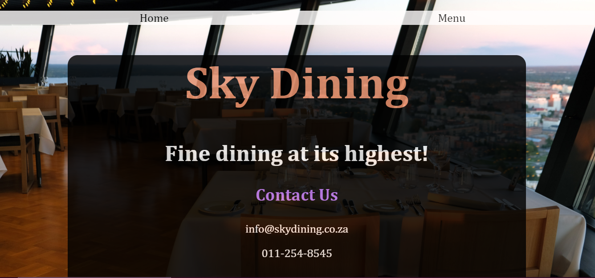

# Restaurant-Site

In this project we were tasked to create a simple site mainly using Javascript DOM manipulation.

## Project Preview

[Live Demo](https://raw.githack.com/SantishaR/RestaurantSite/main/index.html)

## Languages Used

- HTML5
- CSS3
- Javascript ES6

## Contributing
- Pull requests are always welcome. Please open an issue first to discuss what you want to     alter if you want to make big changes.
- To clone the project on your local machine, use: git clone https://github.com/SantishaR/RestaurantSite.git;

## License

[MIT](https://choosealicense.com/licenses/mit/)

## Project Author

Santisha Reddy

- Github: [@SantishaR](https://github.com/SantishaR)

Rorisang Kgwete

- Github: [@Rorisang07](https://github.com/Rorisang07)

## Acknowledgments

 [The Odin Project](https://www.theodinproject.com/paths/foundations/courses/foundations/lessons/dom-manipulation#dom---document-object-model)
